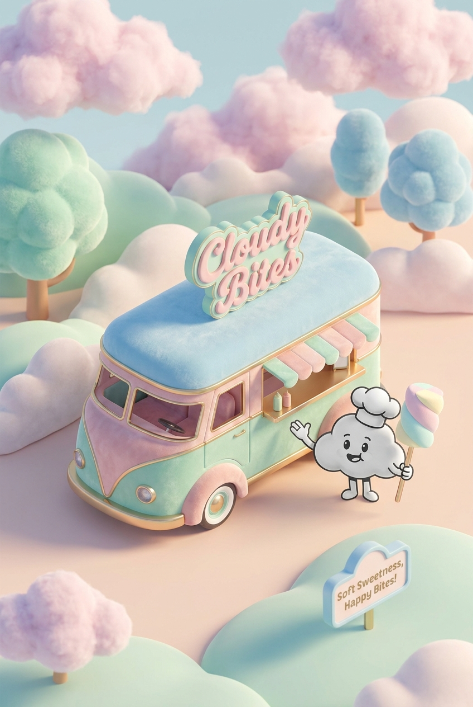

# A 3D-rendered Digital Illustration Featuring A

## Prompt

```text
A 3D-rendered digital illustration featuring a retro-style food truck inspired by the brand [INSERT BRAND NAME], designed with smooth pastel colors and soft textures. A black-and-white cartoon character stands beside the truck, holding a product that visually represents the brand. The environment reflects the brand’s world—playful hills, trees, and skies stylized with its color palette and product shapes. The brand’s logo is clearly displayed on the truck, and a short slogan appears naturally within the scene. Format: 1:1, isometric view, cinematic lighting, clean and joyful composition. Aspect ratio 2:3. Style and mood: High-quality AI visual inspiration. Lighting: Balanced cinematic lighting. Composition: Vertical Pinterest-friendly composition. Detail level: high. High quality output, clean details.
```

## Model
- gemini-3-pro-image-preview

## Suggested Settings
- Aspect Ratio: 2:3
- Style / Mood: High-quality AI visual inspiration
- Lighting: Balanced cinematic lighting
- Composition: Vertical Pinterest-friendly composition
- Detail Level: high

## Copy-ready Prompt

```text
A 3D-rendered digital illustration featuring a retro-style food truck inspired by the brand [INSERT BRAND NAME], designed with smooth pastel colors and soft textures. A black-and-white cartoon character stands beside the truck, holding a product that visually represents the brand. The environment reflects the brand’s world—playful hills, trees, and skies stylized with its color palette and product shapes. The brand’s logo is clearly displayed on the truck, and a short slogan appears naturally within the scene. Format: 1:1, isometric view, cinematic lighting, clean and joyful composition. Aspect ratio 2:3. Style and mood: High-quality AI visual inspiration. Lighting: Balanced cinematic lighting. Composition: Vertical Pinterest-friendly composition. Detail level: high. High quality output, clean details.

Rendering requirements:
- Aspect ratio: 2:3
- Style/Mood: High-quality AI visual inspiration
- Lighting: Balanced cinematic lighting
- Composition: Vertical Pinterest-friendly composition
- Detail level: high

Please keep strong consistency with the above settings.
```

## Image

