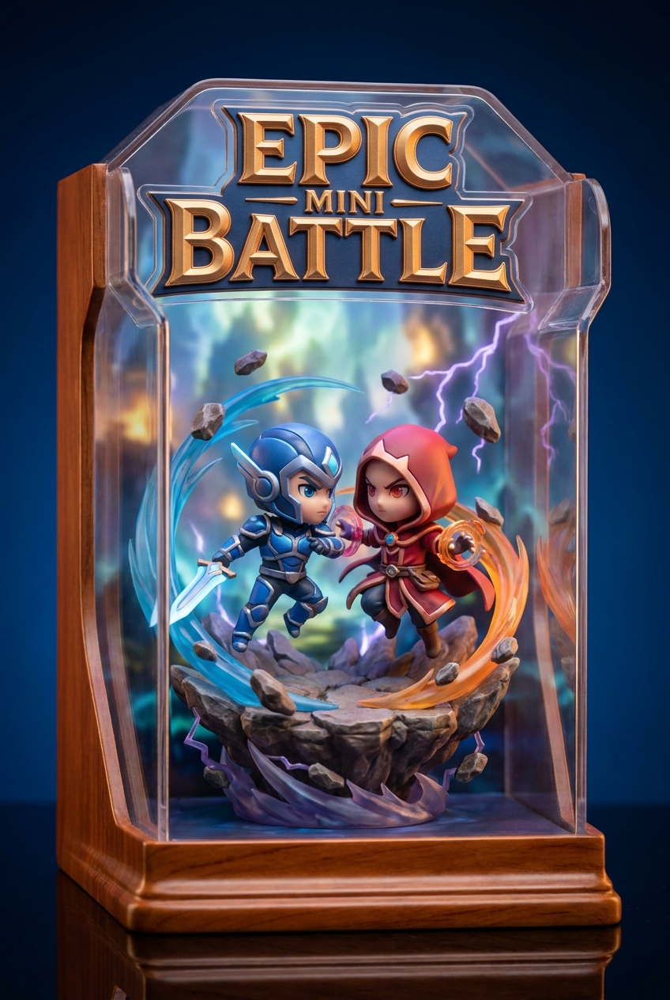

# Highly Detailed 3D-rendered Chibi Figurine Diorama

## Prompt

```text
Highly detailed 3D-rendered chibi figurine diorama of [Character A] and [Character B], captured in a [scene/action], inside a [thematic display case shape] with [material]. The background features [visual effects: debris, aura, lightning, scenery], dynamic pose. The title "[custom phrase]" is embossed at the top in [font/style], matching the tone. Lighting is [studio, cinematic, ambient], color palette of [main colors]. Designed in a collectible, stylized, viral-friendly aesthetic. Aspect ratio 2:3. Style and mood: High-quality AI visual inspiration. Lighting: Balanced cinematic lighting. Composition: Vertical Pinterest-friendly composition. Detail level: high. High quality output, clean details.
```

## Model
- gemini-3-pro-image-preview

## Suggested Settings
- Aspect Ratio: 2:3
- Style / Mood: High-quality AI visual inspiration
- Lighting: Balanced cinematic lighting
- Composition: Vertical Pinterest-friendly composition
- Detail Level: high

## Copy-ready Prompt

```text
Highly detailed 3D-rendered chibi figurine diorama of [Character A] and [Character B], captured in a [scene/action], inside a [thematic display case shape] with [material]. The background features [visual effects: debris, aura, lightning, scenery], dynamic pose. The title "[custom phrase]" is embossed at the top in [font/style], matching the tone. Lighting is [studio, cinematic, ambient], color palette of [main colors]. Designed in a collectible, stylized, viral-friendly aesthetic. Aspect ratio 2:3. Style and mood: High-quality AI visual inspiration. Lighting: Balanced cinematic lighting. Composition: Vertical Pinterest-friendly composition. Detail level: high. High quality output, clean details.

Rendering requirements:
- Aspect ratio: 2:3
- Style/Mood: High-quality AI visual inspiration
- Lighting: Balanced cinematic lighting
- Composition: Vertical Pinterest-friendly composition
- Detail level: high

Please keep strong consistency with the above settings.
```

## Image

